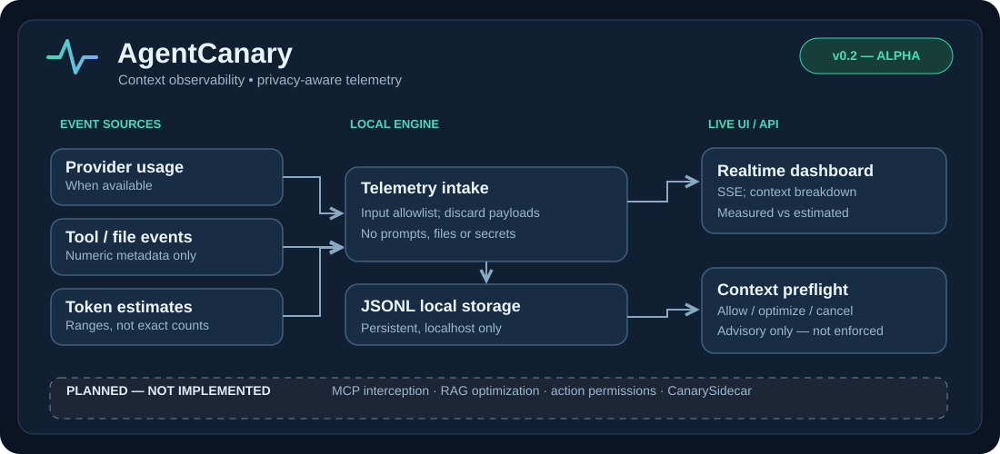

# AgentCanary — Local-first Context Observability



[](https://github.com/gabrieledellamalva06-coding/agentcanary/actions/workflows/ci.yml)


**Local-first context observability for agent toolchains. Alpha / proof of concept.**

> This repository starts with a working local telemetry dashboard. It is NOT yet a transparent interception proxy, MCP firewall, tokenizer, security scanner or AI integration. Do not use it as a production security boundary.

## Quick start

Requires Node.js 20+. No dependencies or API keys.

```bash
npm start
# In another terminal:
npm run demo
```

Open <http://127.0.0.1:4318>. Telemetry events persist in `.data/events.jsonl` and reload on restart; new events appear live via SSE.

## API

`POST /v1/events` (numeric metadata only)

```json
{"component":"tool_outputs","source":"estimate","tokens":200,"maxTokens":360}
```

Permitted components: `messages`, `tool_outputs`, `file_reads`, `tool_schemas`, `system_memory`, `other`. `source` is `provider`, `tokenizer` or `estimate`. All unknown fields (including text/payloads) are discarded. `provider` events represent snapshots, **not** a guarantee that counts sum neatly with estimated component observations.

`POST /v1/preflight`:

```json
{"expectedOutputChars":12000,"policyLimit":0.85}
```

Returns current and projected **ranges**, plus `allow`, `optimize_with_rag` or `cancel` as an **advisory recommendation**. Automatic RAG/optimization and tool interception are not implemented yet.

`GET /v1/status`; `GET /v1/events/stream` (SSE).

## Data limitations and privacy

- Character-based estimates are a rough range. Their `confidence` is `low`; they are not tokenizer output.
- True model context usage requires model/provider integration and may include unobservable hidden tokens. Never present estimated numbers as exact.
- No prompts, tool args, file contents, headers or secrets are retained by the API.
- Server binds to localhost by default, no authentication; do **not** expose its port publicly.
- Running demo multiple times appends extra demo events. Delete `.data/events.jsonl` locally to reset.

## Roadmap

- v0.2a — estimator + numeric telemetry: **initial proof of concept**
- v0.2b — local persistent live dashboard: **initial proof of concept**
- v0.2c — actual preflight interception/policies: **planned**; advisory endpoint exists
- v0.2d — context composition/waste audit: **planned**
- v0.3 — CanarySidecar action/permission telemetry: **planned**

## Project status & license

This repository is an **alpha proof of concept**, not a complete MCP firewall, security boundary, or production-ready integration. The diagram distinguishes current capabilities from planned features.

**Licensing:** No open-source license is currently granted in this repository. The author retains copyright; public availability is not permission to reuse, redistribute, or commercialize this code. Contributions should be discussed in an issue before proposing changes. An explicit license may be added later.

## For contributors and reviewers

- Run `npm test` to execute the dependency-free unit tests.
- Run `npm start`, then `npm run demo` in a second terminal; open `http://127.0.0.1:4318` for the local UI.
- Do not interpret heuristic token ranges as provider measurements.
- Do not expose the localhost telemetry endpoint directly to the internet.

